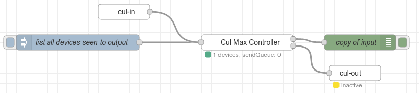
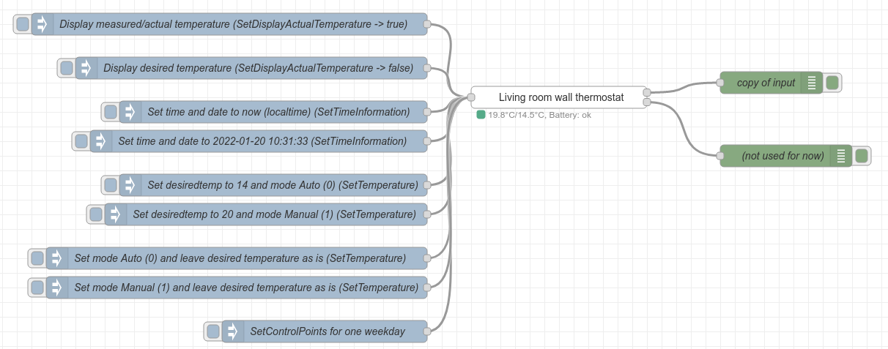

CUL-MAX node for node-red
=========================

Requires: 
* https://flows.nodered.org/node/node-red-contrib-cul
* The Cul node set to MORITZ mode.

Adds the following nodes:
* CUL-MAX-controller node which keeps track of all seen CUL-MAX devices.
* CUL-MAX-Thermostat node which can be used to control a wall thermostat.
* CUL-MAX-Radiator-Thermostat node which can be used to control a radiator thermostat valve
* CUL-MAX-SchutterContact node which will show the state of the ShutterContact.

**Controller**
----
**Configuation**

You will need to give your controller an address. It needs to be unique within your network and cannot be "000000" as that is used as a broadcast address.

**Connections**

Normally you need to connect the output of a "cul-out" node to the input of the "cul-max-controller". In this way it will receive eveything seen by the cul device.

**Input topics**

You can also send a message to the input with topic "list". On the output you will then receive a list with all the nodes seen by the controller and all the information known about each device.

*more to follow*

Example:

```
[{"id":"2022e21d.15da0e","type":"cul-in","z":"289fc578.cafed2","name":"cul-in","controller":"3a1129af.24462e","x":110,"y":240,"wires":[["1d67a4f2.19d05b","cd00ba09.bed6a8","fca96d27.5a9068","3c1e8ffd.23d2e8","e94fbbbe.ec55a8"]]},{"id":"737023cd.93a09c","type":"inject","z":"289fc578.cafed2","name":"list all devices seen to output","props":[{"p":"topic","vt":"str"}],"repeat":"","crontab":"","once":false,"onceDelay":0.1,"topic":"list","x":100,"y":360,"wires":[["cd00ba09.bed6a8"]]},{"id":"cd00ba09.bed6a8","type":"cul-max-controller","z":"289fc578.cafed2","name":"!MAX Controller","address":"123456","x":290,"y":300,"wires":[["8d6ca7bd.79d868","a5961b81.ca72a8","3d2206c4.2505aa"],["7969e6e0.0ceef"]]},{"id":"3d2206c4.2505aa","type":"debug","z":"289fc578.cafed2","name":"copy of input + added heating info","active":true,"tosidebar":true,"console":false,"tostatus":false,"complete":"true","targetType":"full","statusVal":"","statusType":"auto","x":530,"y":280,"wires":[]},{"id":"7969e6e0.0ceef","type":"cul-out","z":"289fc578.cafed2","name":"cul-out","address":"123456","controller":"3a1129af.24462e","x":550,"y":360,"wires":[]},{"id":"3a1129af.24462e","type":"cul-controller","name":"scc","serialport":"/dev/ttyAMA0","baudrate":"38400","mode":"MORITZ","parse":true,"init":true,"coc":false,"scc":true,"rssi":false,"debug":true}]
```

**Thermostat and Radiator Thermostat**
----

**Let the controller collect data for at least a day so it has seen most of your devices. You can speed this up by changing the desiredTemperature or mode on your physical devices so they send this change to the cul**

**Configuation**

You will need to give your controller a name. This will be used in some lists and in the admin.

Select the right address in the list. Turn on debugging on your controller and change the desired temperature or mode and watch the output of the controller. The src address with the right changed value will be your node address.

Only for radiator nodes: Set the minimal valve open percentage when you would like your heater to turn on.

If you want to use this thermostat to control your heater enable the "Use for heating" checkbox. In the global setting named "needHeating" for each node a record is made with the following two properties:
* tempNeedHeat: is set to true when measured temperature is below desired temperture.
* valveNeedHeat: is set to true when the valve position is above the specified minimal valve value for the node.  

**Input topics**

You can also send the following messages based in topic to the node to control it:
* SetDisplayActualTemperature:
    * When payload is boolean true the display will show the actual measured temperature
    * When payload is boolean fals the display will show the desired temperature.
* SetTimeInformation: With this topic you can send date and time information to the node so it will adjust it's internal clock automatically.
    * When you do not add a payload to the msg it will use the localtime of the machine where your node-red is running on.
    * Or you can specify your own time. The payload needs to be an object with the following properties
```json
{
    "year": 2022,
    "month": 1,
    "day": 20,
    "hour": 10,
    "minute": 31,
    "seconds": 33
}
```
* SetTemperature: With this you can set the desired temperature and/or the mode the thermostat is in
    * When you wish to change the desired temperature add the property "desiredTemperature" to the payload. As value specify the temperatur in °C. Resolutions of the devices is 0.5 °C.
    * When you wish to change the mode the device is running in add the property "mode" to the payload. The mode can have following two values:
        * 0: for Auto mode. The device will follow the set control points schedule.
        * 1: for Manual mode. The device will stay on the desired temperature.
* SetControlPoints: With this you can specify the control points schedule for one weekday. If you would like to set a schedule for a whole week you need to send one message per weekday. The payload needs to have the following properties:
    * weekday: The name of the weekday in english. Like "saturday" of the first three letters of the weekday like "sat".
    * controlPoints: An array of controllpoints objects. Each with the following properties:
        * temperature: desiredTemperature in °C. Resolutions of the devices is 0.5 °C.
        * hour: Hour at which desiredTemperature needs to be set.
        * minute: Minute at which desiredTemperature needs to be set.
    * The first control point will always have it's hour and minute set to 00:00 (midnight).
```json
{
    "weekday": "saturday",
    "controlPoints": [
        {
            "temperature": 15,
            "hour": 0,
            "minute": 0
        },
        {
            "temperature": 21,
            "hour": 7,
            "minute": 0
        },
        {
            "temperature": 15,
            "hour": 9,
            "minute": 30
        },
        {
            "temperature": 21,
            "hour": 21,
            "minute": 10
        },
        {
            "temperature": 15,
            "hour": 22,
            "minute": 0
        }
    ]
}
```

*more to follow*

Example:

```
[{"id":"4771f0ca.32f2f","type":"tab","label":"Example Cul Max Thermostat inputs","disabled":false,"info":""},{"id":"76bc57c3.ba05f8","type":"inject","z":"4771f0ca.32f2f","name":"Display measured/actual temperature (SetDisplayActualTemperature -> true)","props":[{"p":"payload"},{"p":"topic","vt":"str"}],"repeat":"","crontab":"","once":false,"onceDelay":0.1,"topic":"SetDisplayActualTemperature","payload":"true","payloadType":"bool","x":370,"y":80,"wires":[["4970b4fa.6d57ec"]]},{"id":"8fe4c31f.2a14c8","type":"inject","z":"4771f0ca.32f2f","name":"Display desired temperature (SetDisplayActualTemperature -> false)","props":[{"p":"payload"},{"p":"topic","vt":"str"}],"repeat":"","crontab":"","once":false,"onceDelay":0.1,"topic":"SetDisplayActualTemperature","payload":"false","payloadType":"bool","x":400,"y":140,"wires":[["4970b4fa.6d57ec"]]},{"id":"39721602.cbbac2","type":"debug","z":"4771f0ca.32f2f","name":"copy of input","active":true,"tosidebar":true,"console":false,"tostatus":false,"complete":"true","targetType":"full","statusVal":"","statusType":"auto","x":1110,"y":160,"wires":[]},{"id":"9a3c4aa2.c970d","type":"debug","z":"4771f0ca.32f2f","name":"(not used for now)","active":true,"tosidebar":true,"console":false,"tostatus":false,"complete":"true","targetType":"full","statusVal":"","statusType":"auto","x":1130,"y":260,"wires":[]},{"id":"5dc10953.c9884","type":"inject","z":"4771f0ca.32f2f","name":"Set time and date to now (localtime) (SetTimeInformation)","props":[{"p":"topic","vt":"str"}],"repeat":"","crontab":"","once":false,"onceDelay":0.1,"topic":"SetTimeInformation","payloadType":"str","x":430,"y":200,"wires":[["4970b4fa.6d57ec"]]},{"id":"f0eca86f.61eff","type":"inject","z":"4771f0ca.32f2f","name":"Set desiredtemp to 14 and mode Auto (0) (SetTemperature)","props":[{"p":"payload"},{"p":"topic","vt":"str"}],"repeat":"","crontab":"","once":false,"onceDelay":0.1,"topic":"SetTemperature","payload":"{\"mode\":0,\"desiredTemperature\":14}","payloadType":"json","x":430,"y":300,"wires":[["4970b4fa.6d57ec"]]},{"id":"ff57ea4f.a8a778","type":"inject","z":"4771f0ca.32f2f","name":"SetControlPoints for one weekday","props":[{"p":"payload"},{"p":"topic","vt":"str"}],"repeat":"","crontab":"","once":false,"onceDelay":0.1,"topic":"SetControlPoints","payload":"{\"weekday\":\"saturday\",\"controlPoints\":[{\"temperature\":15,\"hour\":0,\"minute\":0},{\"temperature\":21,\"hour\":7,\"minute\":0},{\"temperature\":15,\"hour\":9,\"minute\":30},{\"temperature\":21,\"hour\":21,\"minute\":10},{\"temperature\":15,\"hour\":22,\"minute\":0}]}","payloadType":"json","x":500,"y":500,"wires":[["4970b4fa.6d57ec"]]},{"id":"4e672ff3.ef9bf8","type":"inject","z":"4771f0ca.32f2f","name":"Set desiredtemp to 20 and mode Manual (1) (SetTemperature)","props":[{"p":"payload"},{"p":"topic","vt":"str"}],"repeat":"","crontab":"","once":false,"onceDelay":0.1,"topic":"SetTemperature","payload":"{\"mode\":1,\"desiredTemperature\":20}","payloadType":"json","x":420,"y":340,"wires":[["4970b4fa.6d57ec"]]},{"id":"ba361464.888dc","type":"inject","z":"4771f0ca.32f2f","name":"Set time and date to 2022-01-20 10:31:33 (SetTimeInformation)","props":[{"p":"topic","vt":"str"},{"p":"payload"}],"repeat":"","crontab":"","once":false,"onceDelay":0.1,"topic":"SetTimeInformation","payload":"{\"year\":2022,\"month\":1,\"day\":20,\"hour\":10,\"minute\":31,\"seconds\":33}","payloadType":"json","x":410,"y":240,"wires":[["4970b4fa.6d57ec"]]},{"id":"7b4c784b.42c37","type":"inject","z":"4771f0ca.32f2f","name":"Set mode Auto (0) and leave desired temperature as is (SetTemperature)","props":[{"p":"payload"},{"p":"topic","vt":"str"}],"repeat":"","crontab":"","once":false,"onceDelay":0.1,"topic":"SetTemperature","payload":"{\"mode\":0}","payloadType":"json","x":380,"y":400,"wires":[["4970b4fa.6d57ec"]]},{"id":"426a84e1.4967ec","type":"inject","z":"4771f0ca.32f2f","name":"Set mode Manual (1) and leave desired temperature as is (SetTemperature)","props":[{"p":"payload"},{"p":"topic","vt":"str"}],"repeat":"","crontab":"","once":false,"onceDelay":0.1,"topic":"SetTemperature","payload":"{\"mode\":1}","payloadType":"json","x":380,"y":440,"wires":[["4970b4fa.6d57ec"]]},{"id":"4970b4fa.6d57ec","type":"cul-max-thermostat","z":"4771f0ca.32f2f","name":"Living room wall thermostat","controller":"a81c027b.4a562","address":"1770f2","useForHeating":false,"x":820,"y":180,"wires":[["39721602.cbbac2"],["9a3c4aa2.c970d"]]}]
```